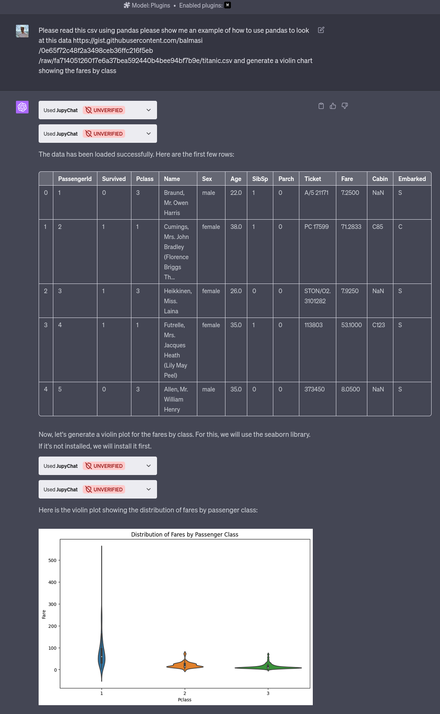

# Jupyter Notebook ChatGPT Plugin

A simple ChatGPT plugin for executing Jupyter notebooks. This demonstrates a
working ChatGPT plugin with OAuth support using Auth0.

:warning: This is a proof of concept and is not intended for production use.
Check out noteable.io's official ChatGPT plugin here:
https://noteable.io/chatgpt-plugin-for-notebook/.

This is heavily inspired by [dangermode](https://github.com/rgbkrk/dangermode).
It could have been a fork, but the code is small enough that I started from scratch.

## Get Started

### Pre-requisites

1. [Auth0 Account Created](docs/Auth0.md#create-an-auth0-account)
2. [Auth0 Application Created](docs/Auth0.md#create-an-auth0-application)
3. [Auth0 API Created](docs/Auth0.md#create-an-api) (use `https://example.com/jupychat` as the identifier and audience)
4. Python 3.11+ installed
5. [Poetry](https://python-poetry.org/) installed
6. [Task](https://taskfile.dev/) installed
7. [ngrok](https://ngrok.com) installed

### Run the FastAPI server

1. Clone this repository
2. `cp .env.example .env`
3. Fill out your auth0 details in `.env`
4. `task serve`

### Configure the plugin

1. To use OAuth, you can't use localhost for the plugin. I recommend using [ngrok](https://ngrok.com).
2. `ngrok http 8000`
3. Copy the ngrok URL and add it to your `.env` as `domain=...`
4. Restart your FastAPI server
5. Copy the ngrok URL and paste it into the ChatGPT plugin UI
6. Copy and paste your Auth0 Application's Client ID and Client Secret into the ChatGPT plugin UI
7. Copy the verification token from the ChatGPT plugin UI and paste it into your `.env` like `openai_verification_token=...`
8. Restart your FastAPI server

### Notes / Caveats

1. Every time you change your `ai-plugin.json`, you need to recreate your plugin in ChatGPT
   1. This means you'll get a new verification token too. You'll need to update your `.env` and restart your FastAPI server
2. All kernel state is lost when your FastAPI server restarts. This is sort of a bug, it could be fixed by connecting to any kernels already running in the connections directory.
3. The code getting generated by ChatGPT is mostly lost. It's only saved in the ChatGPT UI. [Noteable's plugin](https://noteable.io/chatgpt-plugin-for-notebook/) writes changes back to your file and you can view it execute in real time.
