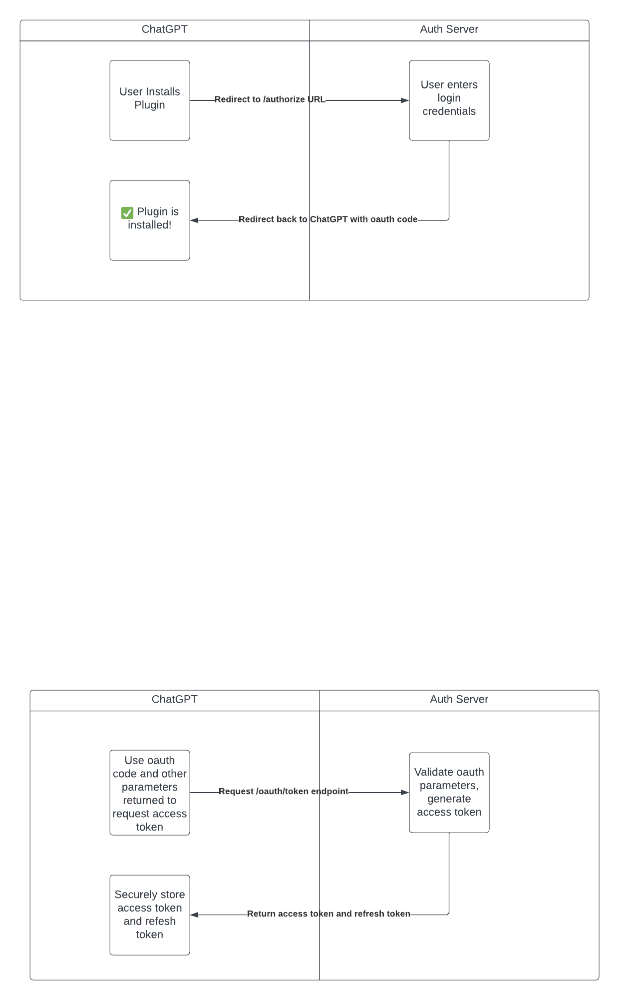

# ChatGPT OAuth

OAuth for ChatGPT plugins is less than straightforward.
This document will explain the process and give an example using Auth0.

## High Level Overview

## Part 1: User logs into our plugin

1. When the user installs our plugin, they will be prompted to log in.
1. ChatGPT will redirect the user to the `/authorize` endpoint we configured in our `ai-plugin.json` (`client_url`).
1. After the user enters their credentials, they will be redirected back to ChatGPT with a `code` query parameter.
1. From the user's perspective, they are now logged in and ready to use the plugin.

## Part 2: ChatGPT gets an access token

It's hard to say _exactly_ when ChatGPT requests an access token, so for our purposes, let's say it's when the user first uses the plugin.

1. The user requests to user our plugin
1. ChatGPT will make a request to the `/oauth/token` endpoint we configured in our `ai-plugin.json` (`authorization_url`).
1. This will redeem the `code` for an `access_token` and `refresh_token`.
1. ChatGPT will now use the `access_token` when making requests to our API.
